```{=html}
<div class="cv-header-actions">
  <a href="CV/CV_detaille_Egal_Emilio.docx" target="_blank" class="btn-download">
    <svg width="18" height="18" viewBox="0 0 24 24" fill="none" stroke="currentColor" stroke-width="2"><path d="M21 15v4a2 2 0 0 1-2 2H5a2 2 0 0 1-2-2v-4"/><polyline points="7 10 12 15 17 10"/><line x1="12" y1="15" x2="12" y2="3"/></svg>
    Download full CV (Word)
  </a>
</div>
```

## Academic Background

```{=html}
<div class="timeline">

  <div class="timeline-item">
    <div class="timeline-dot accent"></div>
    <div class="timeline-date">2025 (3 months)</div>
    <div class="timeline-logos">
      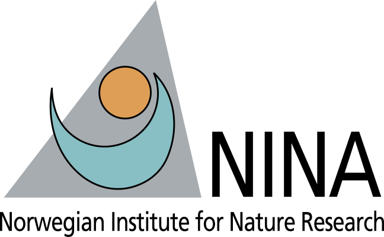
    </div>
    <div class="timeline-content">
      <h3>Erasmus+ Research</h3>
      <p class="timeline-place">Norwegian Institute of Nature Research (NINA), Trondheim, Norway</p>
      <p>Collaboration with Yann Czorlich & Geir H. Bolstad. Funded by ERASMUS+, DESSE INRAE & Région Bretagne.</p>
    </div>
  </div>

  <div class="timeline-item">
    <div class="timeline-dot"></div>
    <div class="timeline-date">2023 – 2026</div>
    <div class="timeline-logos">
      
      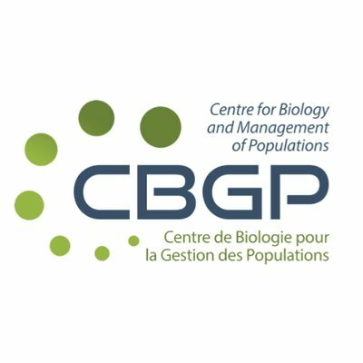
      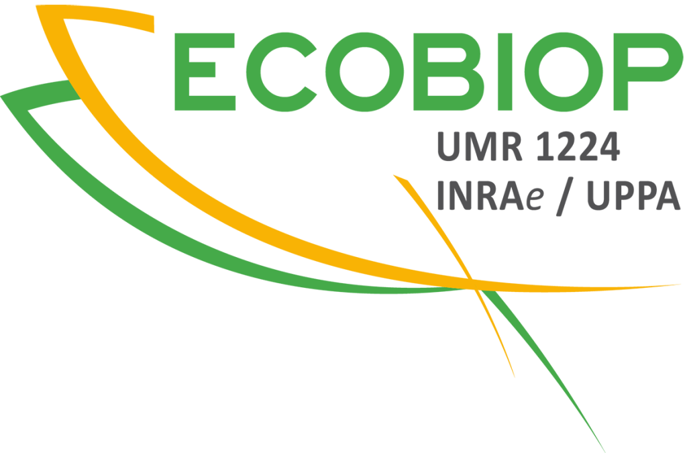
      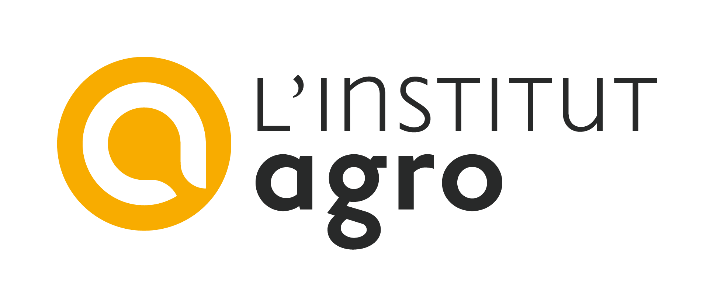
      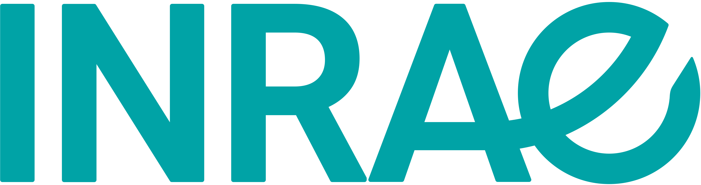
    </div>
    <div class="timeline-content">
      <h3>PhD in Evolutionary Genetics & Population Genomics</h3>
      <p class="timeline-place">DECOD UMR 0985, INRAE – Institut Agro, Rennes, France</p>
      <p>Dispersal and local adaptation of Atlantic salmon (<em>Salmo salar</em>) by genetic approaches.<br>
      Supervisors: Mathieu Buoro, Charles Perrier & Guillaume Evanno</p>
    </div>
  </div>

  <div class="timeline-item">
    <div class="timeline-dot accent"></div>
    <div class="timeline-date">2023 (6 months)</div>
    <div class="timeline-logos">
      
      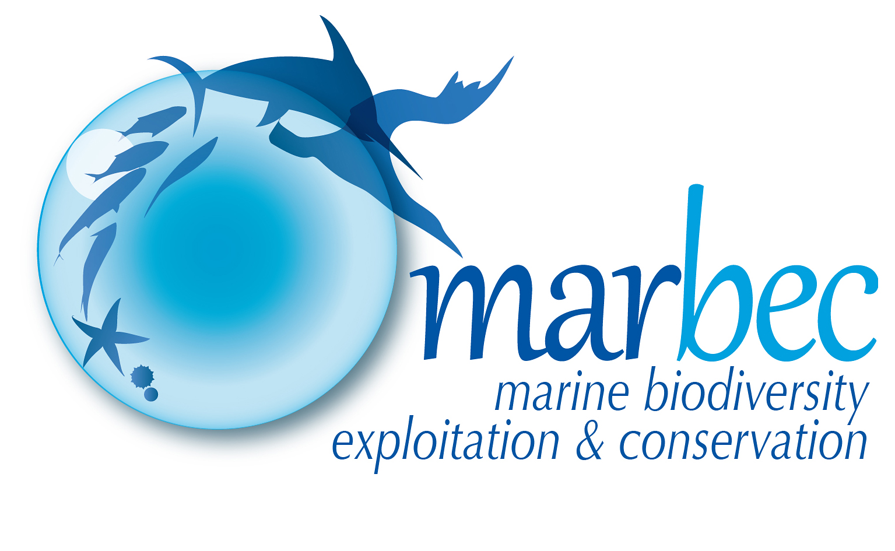
    </div>
    <div class="timeline-content">
      <h3>MSc Research Internship</h3>
      <p class="timeline-place">UMR MARBEC, IFREMER Station, Sète, France</p>
      <p>Biogeography and connectivity of cold-water corals <em>Desmophyllum pertusum</em> using genomic approaches.<br>
      Supervisors: Sophie Arnaud-Haond & Adrien Tran Lu Y</p>
    </div>
  </div>

  <div class="timeline-item">
    <div class="timeline-dot accent"></div>
    <div class="timeline-date">2022 (2 months)</div>
    <div class="timeline-logos">
      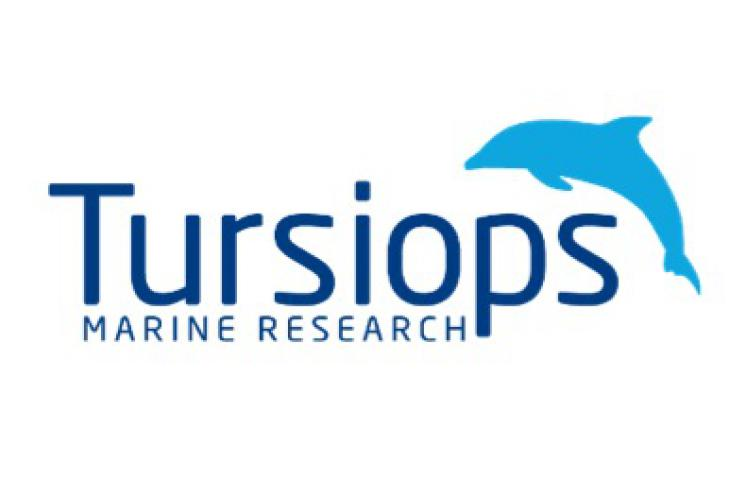
    </div>
    <div class="timeline-content">
      <h3>MSc Research Internship</h3>
      <p class="timeline-place">Tursiops Marine Research, Palma de Mallorca, Spain</p>
      <p>Intra- and inter-population comparisons of signature whistles of bottlenose dolphin (<em>Tursiops truncatus</em>).<br>
      Supervisor: Txema Brotons</p>
    </div>
  </div>

  <div class="timeline-item">
    <div class="timeline-dot"></div>
    <div class="timeline-date">2021 – 2023</div>
    <div class="timeline-logos">
      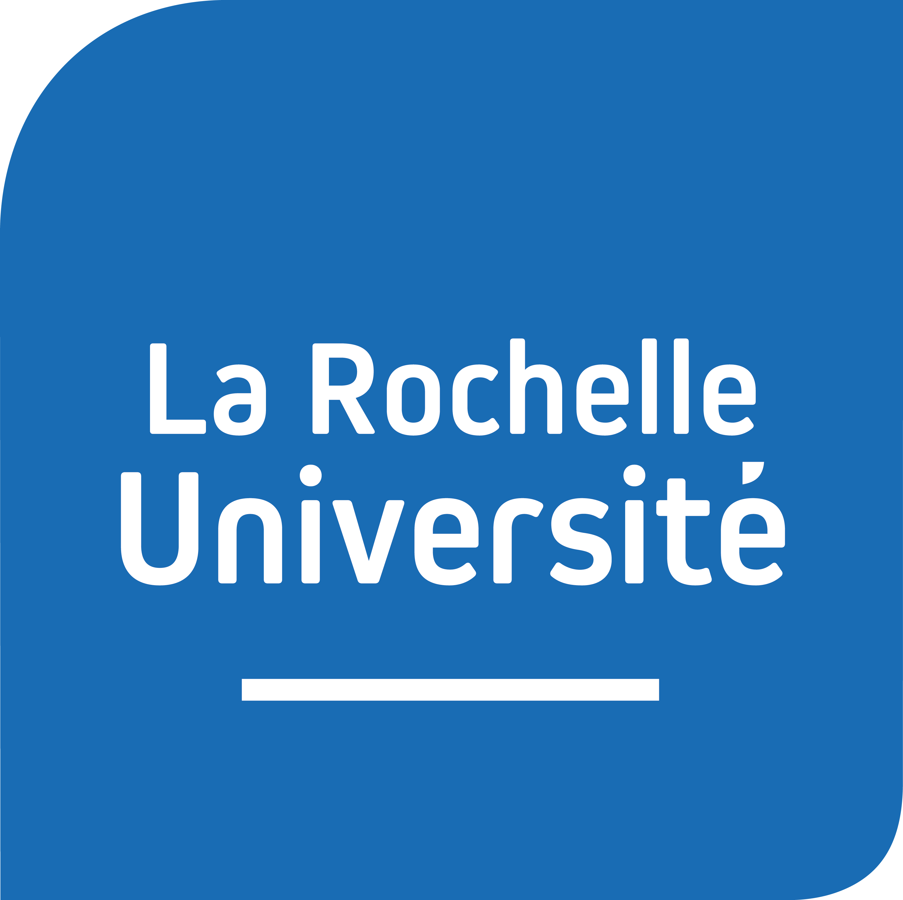
    </div>
    <div class="timeline-content">
      <h3>MSc Environmental Management & Coastal Ecology</h3>
      <p class="timeline-place">University of La Rochelle, France</p>
      <p>Distinction — 2<sup>nd</sup>/31</p>
      <p>Universitary Diploma Underwater sampling — <a href="https://formations.univ-larochelle.fr/du-biosoum" target="_blank" rel="noopener noreferrer">BIOSOUM</a></p>
    </div>
  </div>

  <div class="timeline-item">
    <div class="timeline-dot accent"></div>
    <div class="timeline-date">2020 – 2021 (5 months)</div>
    <div class="timeline-logos">
      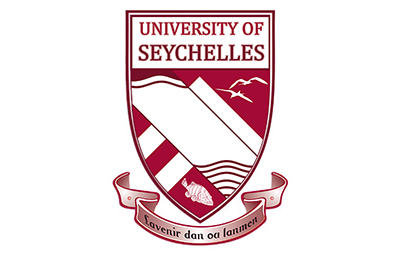
      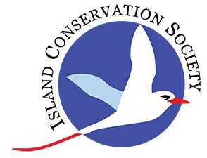
    </div>
    <div class="timeline-content">
      <h3>Volunteer Research Internship — Gap Year</h3>
      <p class="timeline-place">University of Seychelles & Island Conservation Society, Aride Island, Seychelles</p>
      <p>Population dynamics of <em>Phaethon lepturus</em> & <em>Copsychus sechellarum</em> / Reproductive success of sea turtles.<br>
      Supervisor: Gérard Rocamora</p>
    </div>
  </div>

  <div class="timeline-item">
    <div class="timeline-dot"></div>
    <div class="timeline-date">2017 – 2020</div>
    <div class="timeline-logos">
      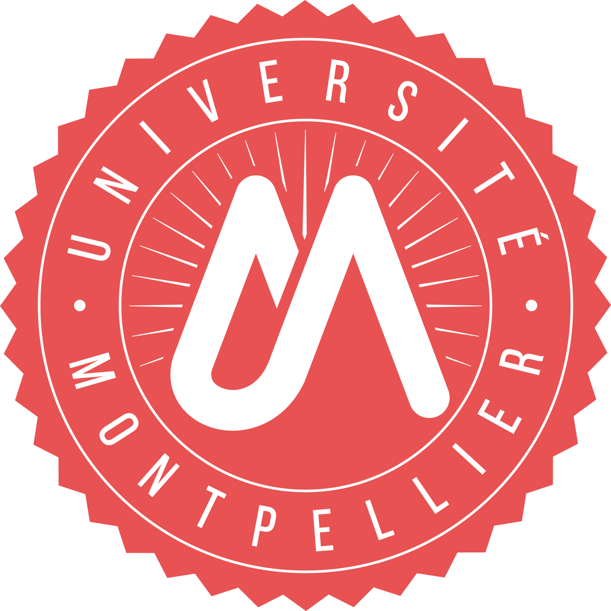
    </div>
    <div class="timeline-content">
      <h3>BSc in Biology, Environment & Earth Sciences</h3>
      <p class="timeline-place">University of Montpellier, France</p>
    </div>
  </div>

</div>
```

## 📢 Scientific Communications

```{=html}
<div class="timeline">

  <!-- International -->
  <div class="timeline-item">
    <div class="timeline-dot"></div>
    <div class="timeline-date">February 2026</div>
    <div class="timeline-logos">
      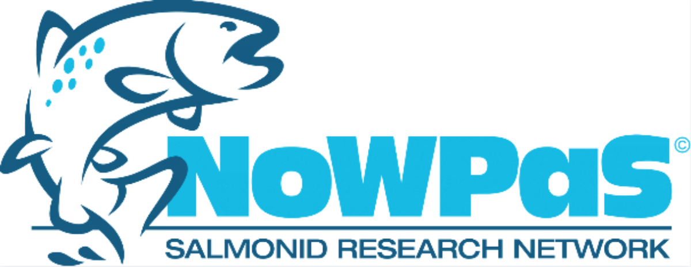
    </div>
    <div class="timeline-content">
      <h3>Oral Presentation — International Workshop of PhDs and Post-doctoral Fellows on Anadromous Salmonids</h3>
      <p class="timeline-place">Hólar, Iceland</p>
      <p><strong>Egal E.</strong> High-density SNP genotyping uncovers fine-scale genetic structure and genetic basis of local adaptation in Atlantic salmon (<em>Salmo salar</em>).</p>
    </div>
  </div>

  <div class="timeline-item">
    <div class="timeline-dot"></div>
    <div class="timeline-date">October 2025</div>
    <div class="timeline-logos">
      
    </div>
    <div class="timeline-content">
      <h3>Oral Presentation — NINA Lab Seminar</h3>
      <p class="timeline-place">Trondheim, Norway</p>
      <p><strong>Egal E.</strong> Reproductive success of dispersers depends on the population of origin in Atlantic salmon.</p>
    </div>
  </div>

  <div class="timeline-item">
    <div class="timeline-dot"></div>
    <div class="timeline-date">August 2025</div>
    <div class="timeline-logos">
      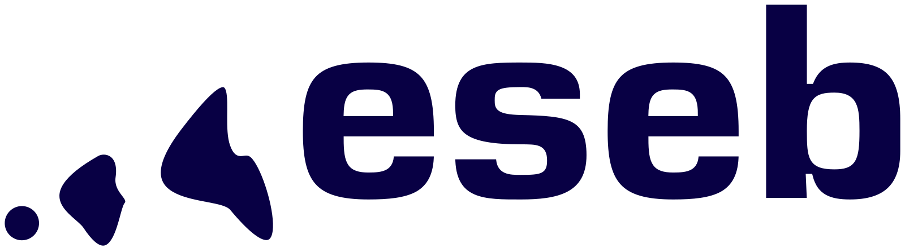
    </div>
    <div class="timeline-content">
      <h3>Poster — Congress of the European Society for Evolutionary Biology (ESEB)</h3>
      <p class="timeline-place">Barcelona, Spain</p>
      <p><strong>Egal E.</strong> Reproductive success of dispersers depends on the population of origin in Atlantic salmon.</p>
    </div>
  </div>

  <div class="timeline-item">
    <div class="timeline-dot"></div>
    <div class="timeline-date">August 2025</div>
    <div class="timeline-logos">
      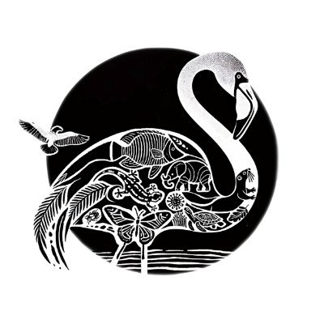
    </div>
    <div class="timeline-content">
      <h3>Oral Presentation — 17th Ecology & Behaviour Conference</h3>
      <p class="timeline-place">Montpellier, France</p>
      <p><strong>Egal E.</strong> Reproductive success of dispersers depends on the population of origin in Atlantic salmon.</p>
    </div>
  </div>

  <!-- National -->
  <div class="timeline-item">
    <div class="timeline-dot"></div>
    <div class="timeline-date">June 2025</div>
    <div class="timeline-logos">
      
    </div>
    <div class="timeline-content">
      <h3>Oral Presentation — EvolBiol Rennes</h3>
      <p class="timeline-place">Rennes, France</p>
      <p><strong>Egal E.</strong> Dispersion et succès reproducteur du saumon Atlantique par des approches génétiques.</p>
    </div>
  </div>

  <div class="timeline-item">
    <div class="timeline-dot"></div>
    <div class="timeline-date">June 2024</div>
    <div class="timeline-logos">
      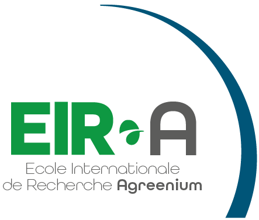
    </div>
    <div class="timeline-content">
      <h3>Oral Presentation — 13ème Séminaire de l'École Internationale de Recherche Agreenium (EIR-A)</h3>
      <p class="timeline-place">Montpellier, France</p>
      <p><strong>Egal E.</strong> Dispersion et succès reproducteur du saumon Atlantique par des approches génétiques.</p>
    </div>
  </div>

</div>
```

## 🏫 Teaching & Supervision

```{=html}
<div class="timeline">

  <div class="timeline-item">
    <div class="timeline-dot"></div>
    <div class="timeline-date">2026 (6 months)</div>
    <div class="timeline-logos">
      
    </div>
    <div class="timeline-content">
      <h3>MSc student — Julia Kamphuis, University of Rennes</h3>
      <p class="timeline-place">Detection of genomic signatures of adaptive introgression in wild Atlantic salmon populations. Co-supervised with Guillaume Evanno.</p>
    </div>
  </div>
  
  <div class="timeline-item">
    <div class="timeline-dot"></div>
    <div class="timeline-date">2024 – 2025</div>
    <div class="timeline-logos">
      
    </div>
    <div class="timeline-content">
      <h3>Teaching Assistant — University of Rennes 1</h3>
      <p class="timeline-place">30+ hours (lectures, practicals, tutorials)</p>
      <div class="teaching-table">
        <table>
          <thead><tr><th>Level</th><th>Module</th><th>Hours</th></tr></thead>
          <tbody>
            <tr><td>BSc 2</td><td>Quantitative Biology</td><td>19h</td></tr>
            <tr><td>MSc 1</td><td>Molecular approaches in ecology & evolution</td><td>5h30</td></tr>
            <tr><td>MSc 1</td><td>Landscape Ecology</td><td>10h30</td></tr>
          </tbody>
        </table>
      </div>
    </div>
  </div>

  <div class="timeline-item">
    <div class="timeline-dot"></div>
    <div class="timeline-date">Autumn 2022</div>
    <div class="timeline-logos">
      
    </div>
    <div class="timeline-content">
      <h3>Educational Tutor — University of La Rochelle</h3>
      <p class="timeline-place">First-year Life Sciences students</p>
    </div>
  </div>

</div>
```


## 🏫 Grants, Scholarships & Awards

```{=html}

<div class="timeline">

  <div class="timeline-item">
    <div class="timeline-dot"></div>
    <div class="timeline-date">2025</div>
    <div class="timeline-content">
      <h3>Erasmus+ Mobility Grant</h3>
      <p class="timeline-place">(€1,710)</p>
    </div>
  </div>

  <div class="timeline-item">
    <div class="timeline-dot"></div>
    <div class="timeline-date">2025</div>
    <div class="timeline-content">
      <h3>DESSE Mobility Grant — EIR-A</h3>
      <p class="timeline-place">(€2,500)</p>
    </div>
  </div>

  <div class="timeline-item">
    <div class="timeline-dot"></div>
    <div class="timeline-date">2025</div>
    <div class="timeline-content">
      <h3>Collège Doctoral de Bretagne — Mobility Grant</h3>
      <p class="timeline-place">(€2,400)</p>
    </div>
  </div>

</div>
```

## 🛠️ Technical Skills

```{=html}
<div class="skills-grid">

  <div class="skill-card">
    <h4>Bioinformatics & Genomics</h4>
    <div class="skill-tags">
      <span>PLINK</span><span>VCFtools</span><span>BCFtools</span><span>BWA-mem2</span>
      <span>SAMtools</span><span>FastQC</span><span>Trimmomatic</span><span>Picard</span>
    </div>
  </div>

  <div class="skill-card">
    <h4>Population Genetics Software</h4>
    <div class="skill-tags">
      <span>BayPass</span><span>BayesAss</span><span>STRUCTURE</span><span>admixture</span>
      <span>assignPOP</span><span>FRANz</span><span>Sequoia</span><span>Arlequin</span>
      <span>Genepop</span><span>PCAdapt</span>
    </div>
  </div>

  <div class="skill-card">
    <h4>Programming & Data Analysis</h4>
    <div class="skill-tags">
      <span>R / RStudio</span><span>ggplot2</span><span>Bash</span><span>Linux / HPC clusters</span>
      <span>Git / GitHub</span>
    </div>
  </div>

  <div class="skill-card">
    <h4>Lab</h4>
    <div class="skill-tags">
      <span>DNA extraction</span>
      <span>Qubit quantification</span><span>Electrophoresis</span>
    </div>
  </div>

  <div class="skill-card">
    <h4>Field</h4>
    <div class="skill-tags">
      <span>SCUBA diving (FFESSM L1)</span><span>Advanced Open Water SSI</span>
      <span>Nitrox Diver (SSI)</span>
    </div>
  </div>

  <div class="skill-card">
    <h4>Languages</h4>
    <div class="skill-tags">
      <span>French (Native)</span><span>English (B2)</span><span>Spanish (B2)</span>
    </div>
  </div>

</div>
```

