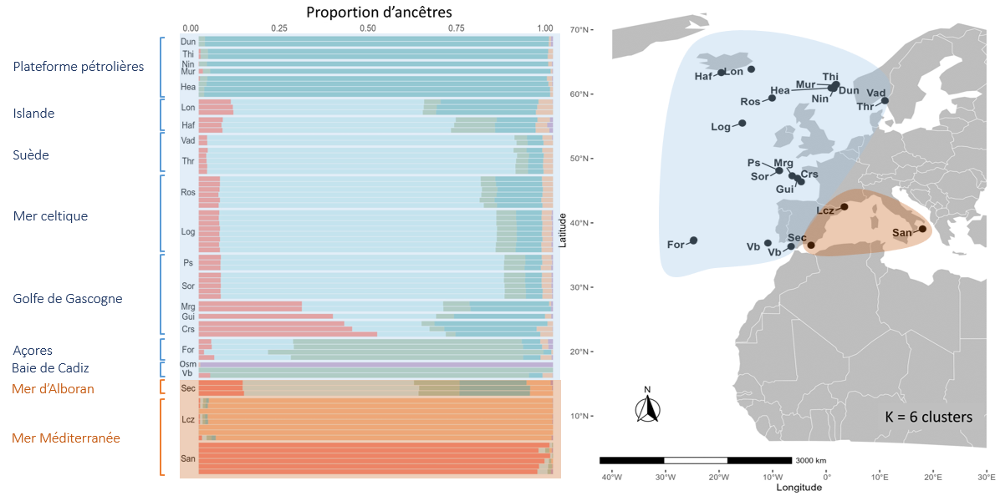

Cold-water coral reefs built by Desmophyllum pertusum (formerly Lophelia pertusa) create three-dimensional deep-sea habitats that host exceptional biodiversity and support key ecosystem services, including habitat provision for commercial fishes and long-term carbon storage. Yet these ecosystems are increasingly threatened by bottom trawling, ocean warming, and acidification, making it crucial to understand their genetic diversity, connectivity, and adaptive potential at basin scale. During my Master’s internship at Ifremer (MARBEC, Sète), I used whole-genome SNP data to characterise the biogeography and genetic connectivity of D. pertusum across the Northeast Atlantic and Mediterranean Sea and to assess how past climate oscillations and present-day circulation shape population structure and conservation priorities.

## Genomic biogeography and connectivity of Desmophyllum pertusum

{fig-alt="Schematic connectivity network and refugia for cold-water coral reefs" fig-align="center" width="80%"}

Colonies of D. pertusum were sampled by ROV on reefs spanning the Northeast Atlantic and the Mediterranean basins, and their genomes were sequenced to obtain a high-density SNP dataset. After filtering for clonality and sequencing artefacts, I quantified genetic diversity and reconstructed population structure using clustering methods and F-statistics, revealing a marked split between Mediterranean and Atlantic lineages with a major breakpoint at the Almeria–Oran Front. Within each basin, genomic scans further refined structure between western and eastern Mediterranean populations and between northern and southern Bay of Biscay reefs, consistent with known phylogeographic junctions and past glacial refugia.