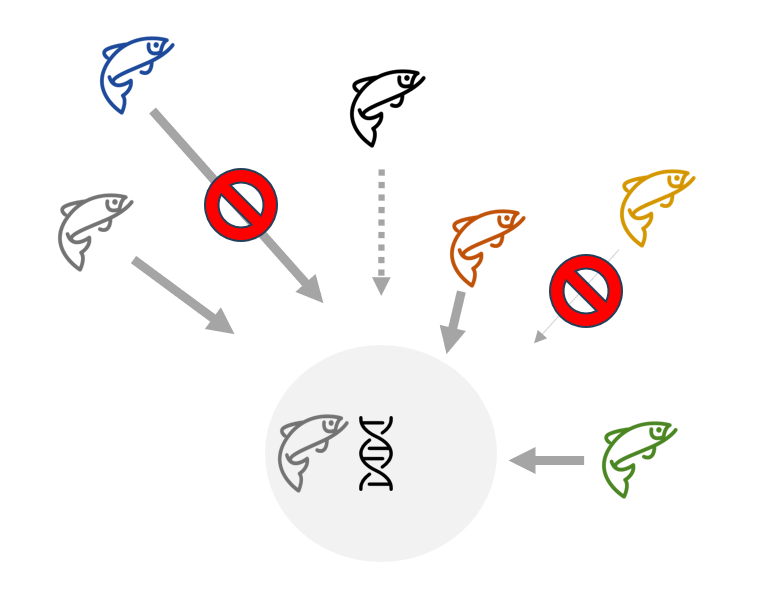
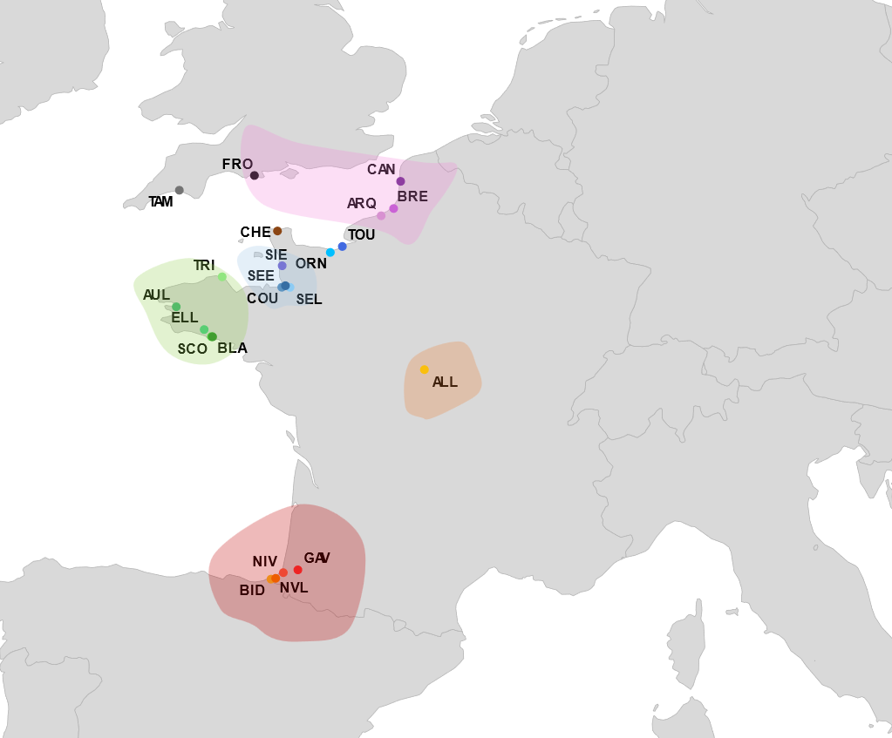

Local adaptation and gene flow between populations are processes often presented as antagonistic: optimal local adaptation theoretically arises under conditions of low gene flow. This antagonism manifests itself through a reduction in the reproductive success of dispersing individuals, a strong genetic structure despite high dispersal, and the existence of highly differentiated genomic regions involved in local adaptation. The Atlantic salmon, known for its strong philopathy and significant genetic structure between populations, can exhibit a relatively high rate of dispersal. This apparent paradox —frequent dispersal but low gene flow efficiency— makes it a prime model for studying this antagonism.

## Selection against dispersers: Origin-dependent fitness differences 

:::{.columns}
::: {.column width="40%"}
{fig-alt="Origin-dependent fitness in Atlantic salmon"}
:::

::: {.column width="5%"}
<!-- colonne vide = espace -->
:::

::: {.column width="55%"}

Local adaptation is often portrayed as uniform fitness disadvantages of immigrants relative to locals. Yet dispersal costs can vary with origin, sex and life-history traits, shaping the balance between gene flow and adaptation. I quantified these heterogeneous costs by comparing the Reproductive Success (RS) of local and immigrant individuals using a 15-year genetic pedigree of Atlantic salmon (*Salmo salar*), including over 1100 adults and 3400 juveniles, in the Nivelle River (south‑west France).
This work was accepted in *Proceedings of the Royal Society B* in April 2026.
:::
:::

## Fine-scale genetic structuring/Genomic basis of local adaptation

:::{.columns}
::: {.column width="40%"}

French Atlantic salmon populations occupy the warm trailing edge of the species' European range, making them among the most exposed to climate-driven habitat deterioration — yet they remain among the least genomically characterised. Previous microsatellite-based work revealed a hierarchical genetic structure across five regional clusters in France, influenced by environmental features [(Perrier et al., 2011)](https://doi.org/10.1111/j.1365-294X.2011.05266.x). However, these markers lacked the statistical resolution to simultaneously characterise fine-scale dispersal dynamics within regional clusters and disentangle the genomic basis of local adaptation.
I first characterised hierarchical population structure and quantified dispersal rates within regional metapopulations. I then conducted genome-wide scans for divergent selection and genome–environment association analyses.

:::

::: {.column width="5%"}
<!-- colonne vide = espace -->

:::
::: {.column width="55%"}
{fig-alt="Origin-dependent fitness in Atlantic salmon"}
:::
:::

# Genomic signatures of adaptive introgression in wild Atlantic salmon populations

### In progress

Most populations are declining and stocking practices using non-local broodstock have been widely implemented and have shaped the current population genetic structure. As a result, genetic introgression is observed in several populations, particularly in Normandy and southwestern France.
While introgression generally decreases over time when stocking is stopped, it may persist for genes that confer selective advantages, creating adaptive introgression events. Such events, well-documented at the interspecific level, remain rarely demonstrated between conspecific populations. Identifying adaptive introgression is crucial for understanding local adaptation mechanisms and informing conservation strategies, particularly genetic rescue approaches through assisted migration.This project aims to analyze genome-wide introgression patterns in French Atlantic salmon populations, distinguishing introgression signatures linked to historical stocking from those resulting from natural dispersal using introgression detection methods.

